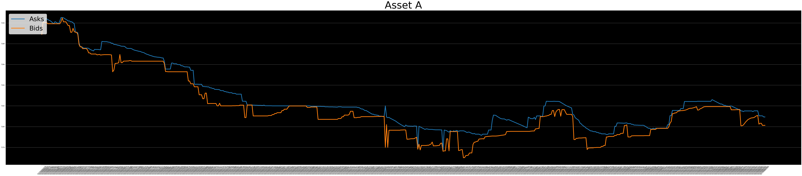
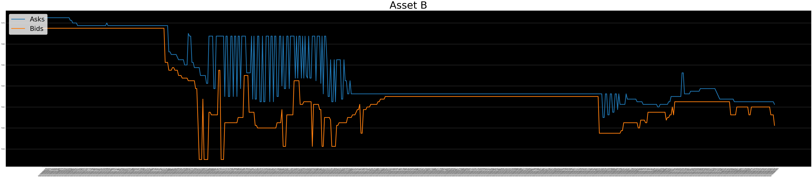

```python
import json
import pandas as pd
import pickle
try:
    %matplotlib inline
except Exception as e:
    pass

import warnings
warnings.filterwarnings("ignore")
import util
with open('./data-40k--1577837713577.json5',mode='r') as f:
    # data:dict = json.load(f)
    data:dict = util.partial_json(f, until_key='1577836893387')


```


```python
datadf = pd.DataFrame.from_dict(data,orient='index')

def asks(state):
    ask_ = state['ask']
    return ask_
def bids(state):
    bid_ = state['bid']
    return bid_

assetA:pd.DataFrame = datadf.assetA.apply([asks, bids])
assetB = datadf.assetB.apply([asks, bids])

```


<div>
<style scoped>
    .dataframe tbody tr th:only-of-type {
        vertical-align: middle;
    }

    .dataframe tbody tr th {
        vertical-align: top;
    }

    .dataframe thead th {
        text-align: right;
    }
</style>
<table border="1" class="dataframe">
  <thead>
    <tr style="text-align: right;">
      <th></th>
      <th>asks</th>
      <th>bids</th>
    </tr>
  </thead>
  <tbody>
    <tr>
      <th>1577836803078</th>
      <td>7170.25</td>
      <td>7169.50</td>
    </tr>
    <tr>
      <th>1577836806371</th>
      <td>7170.25</td>
      <td>7169.50</td>
    </tr>
    <tr>
      <th>1577836806459</th>
      <td>7170.50</td>
      <td>7169.50</td>
    </tr>
    <tr>
      <th>1577836806474</th>
      <td>7170.50</td>
      <td>7169.50</td>
    </tr>
    <tr>
      <th>1577836806575</th>
      <td>7170.50</td>
      <td>7169.50</td>
    </tr>
    <tr>
      <th>...</th>
      <td>...</td>
      <td>...</td>
    </tr>
    <tr>
      <th>1577836892757</th>
      <td>7162.50</td>
      <td>7162.00</td>
    </tr>
    <tr>
      <th>1577836892990</th>
      <td>7162.50</td>
      <td>7161.25</td>
    </tr>
    <tr>
      <th>1577836893181</th>
      <td>7162.50</td>
      <td>7161.25</td>
    </tr>
    <tr>
      <th>1577836893284</th>
      <td>7162.50</td>
      <td>7161.25</td>
    </tr>
    <tr>
      <th>1577836893354</th>
      <td>7162.25</td>
      <td>7160.25</td>
    </tr>
  </tbody>
</table>
<p>603 rows × 2 columns</p>
</div>


```python
util.plot(assetA, title='Asset A')
```





```python
util.plot(assetB, title='Asset B')
```





```python
assetA
```


<div>
<style scoped>
    .dataframe tbody tr th:only-of-type {
        vertical-align: middle;
    }

    .dataframe tbody tr th {
        vertical-align: top;
    }

    .dataframe thead th {
        text-align: right;
    }
</style>
<table border="1" class="dataframe">
  <thead>
    <tr style="text-align: right;">
      <th></th>
      <th>asks</th>
      <th>bids</th>
    </tr>
  </thead>
  <tbody>
    <tr>
      <th>1577836803078</th>
      <td>7189.00</td>
      <td>7188.89</td>
    </tr>
    <tr>
      <th>1577836806371</th>
      <td>7190.09</td>
      <td>7190.05</td>
    </tr>
    <tr>
      <th>1577836806459</th>
      <td>7190.09</td>
      <td>7190.05</td>
    </tr>
    <tr>
      <th>1577836806474</th>
      <td>7190.43</td>
      <td>7190.05</td>
    </tr>
    <tr>
      <th>1577836806575</th>
      <td>7190.39</td>
      <td>7190.05</td>
    </tr>
    <tr>
      <th>...</th>
      <td>...</td>
      <td>...</td>
    </tr>
    <tr>
      <th>1577836892757</th>
      <td>7181.04</td>
      <td>7180.32</td>
    </tr>
    <tr>
      <th>1577836892990</th>
      <td>7181.04</td>
      <td>7180.32</td>
    </tr>
    <tr>
      <th>1577836893181</th>
      <td>7181.03</td>
      <td>7180.11</td>
    </tr>
    <tr>
      <th>1577836893284</th>
      <td>7180.93</td>
      <td>7180.12</td>
    </tr>
    <tr>
      <th>1577836893354</th>
      <td>7180.93</td>
      <td>7180.12</td>
    </tr>
  </tbody>
</table>
<p>603 rows × 2 columns</p>
</div>


